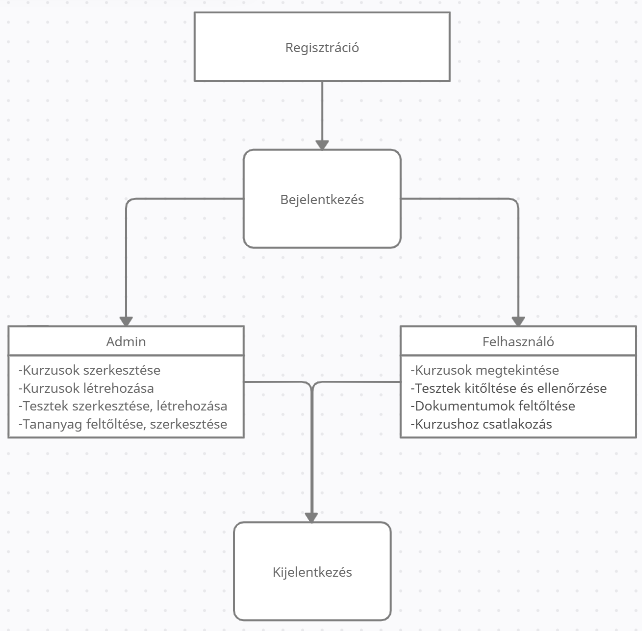
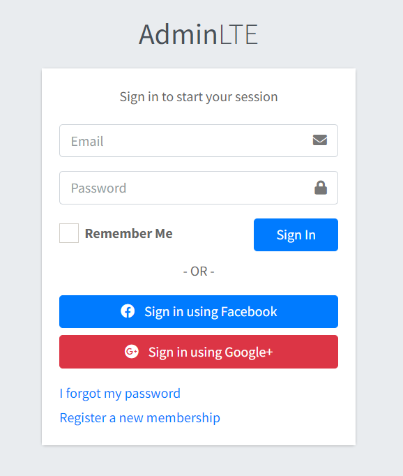
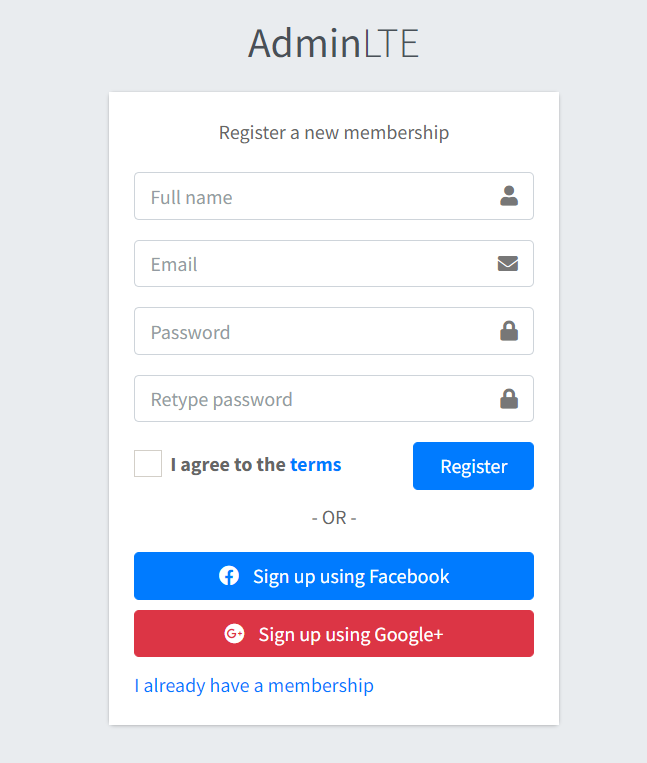

<ol>

## <li> Áttekintés.</li>

A projekt célja, hogy egy olyan online E-learning felületet valósítsunk meg, ami egyszerűen kezelhető a felhasználok számára, illetve áttekinthető online felülettel találkozzon minden látogató. 

Az E-learning felületen elérhető legyen minél több funkció, regisztráció, bejelentkezés, sötét/világos kinézet, kurzusok választása, áttekintése, tesztek választása és kitöltése is.   

A fő cél, hogy egyszerre több kurzus is élérhető legyen, bármely regisztrált felhasználó számára. 

## <li> Jelenlegi helyzet.</li>

A mai világban minden oktatási központnak megvan a saját E-learning portálja, melyek sokban nem különböznek egyszerű és egyértelmű kinézettel/funkciókkal rendelkeznek. 

A mi felületünk ebben különbözik, szeretnénk egy kicsit modernebbé és egyben kicsit érdekesebbé tenni egy hétköznapi program működését és használatát. A plusz beépített funkciók választási lehetőséget adnak a felhasználó számára. Ha a felhasználó bejelentkezett az ehhez tartozó felületen illetve regisztrált, ha új felhasználóról van szó.

Ezek után teljes egészében használhatja a felület minden funkcióját, megtekintheti, a hozza tartozó kurzusait és ahhoz tartozó leírásokat és teszteket is akár, és e mellet például: hogy épp milyen módban szeretné használni a felületet sötét illetve világos módban.

## <li> Követelménylista. </li>

<ol>
<li> Regisztráció
<ul>
 <li> Ezen a felületen tud regisztrálni a felhasználó.</li>
</ul>
</li>
    <li> Bejelentkezés </li>
<ul>
 <li> Ezen a felületen tud bejelentkezni a felhasználó az oldal teljes használatához.</li>
</ul>
    <li> Főoldal </li>
<ul>
 <li>Ha felhasználó bejelentkezik illetve vendégkent látogat, az oldalra akkor ez az oldal jelenik meg alapértelmezetten.</li>
</ul>
    <li> Kurzusok </li>
    <ul>
 <li>Bejelentkezés után a felhasználó ezen a fülön tudja meg tekinteni a saját kurzusait illetve itt választhatja, ki ha bele szeretne menni az egyikbe</li>
</ul>
    <li> Kurzus áttekintés </li>
    <ul>
 <li>A kurzus kiválasztása után a felhasználó itt láthatja a kurzus leírását, tananyagjait, csatolt dokumentumokat, illetve teszteteket</li>
</ul>
<li> Hatáskörök </li>
    <ul>
 <li> Admin: Ezzel a hatáskörrel mindent lehet szerkeszteni, módosítani, törölni. Illetve egyedi beállítási lehetőséggel is rendelkezik </li>
 <li> Vendég: Megtekintheti, az oldalt használhat, néhány funkciót illetve elolvashatja az alapértelmezett információs részeket.</li>
 <li> Felhasználó: Meg tudja nyitni a saját kurzusokat illetve a bennük szereplő információkat, és teszteket is megtekintheti illetve ki is töltheti, őket majd áttekintheti a megoldásokat és eredményket.</li>
</ol>

## <li> Jelenlegi üzleti folyamatok modellje</li>
  
  

## <li> Igényelt üzleti folyamatok modellje</li>
    6.1 Bejelentkezés
        6.1. Kurzosok megtekintése
                6.1.2 Új kurzus hozzáadása
                6.1.3 Kiválasztót kurzus leírásának megtekintése
                6.1.4 A csatlakozott kurzushoz általam hozzáadatt dokumentumok leírások módosítása
                6.1.5 A csatlakozott kurzushoz általam feltöltött dokumentumok, leírások törlése
        6.2 Kijelentkezés
        6.3 Bejelentkezés nélküli felhasználók hatáskörei:
        6.3.1 Alapértelmezett funkciók használata
                6.3.2 Sötét, világos mód váltása
                6.3.3 Főoldal, menük megtekintése illetve alapértelmezett információk áttekintése.
        6.4 Regisztráció
        6.5 Tesztek eredményének megtekintése % illetve pont arányban. 

## <li> Használati esetek </li>
<ul>
<li>Bejelentkezve</li>
<ul>
<li>Kurzusok megtekintése</li>
<li>Kurzusokban levő teszt kitöltésé</li>
<li>Kurzusokban levő teszt ellenőrzése</li>
<li>Kurzushoz való csatlakozás kérelmezése</li>
</ul>
<li>Kijelentkezve</li>
<ul>
<li>Általános információk megtekintése</li>
<li>Fő oldal megtekintése</li>
</ul>
</ul>

## <li> Képernyőterv </li>

### 
Bejelentkező felület képernyőterve

### 
Regisztrációs felület képernyőterve

### 
Főoldal felület képernyőterve

## <li> Forgatókönyv </li>

 A felületet egyszerűen el lehet, érni egy linken keresztül illetve bármilyen böngészőben rá lehet keresni. A felület nem igényel útmutatót úgy terveztük meg, hogy minél egyszerűbb és átláthatóbb legyen a felhasználó számára. Amint a felhasználó rá ment a linkre illetve rá klikkelt a böngészőben meg talált címre, már az oldalon is találja, magát ahol bejelentkezhet és megtekintheti a saját kurzusait. Ha vendég a felhasználó, akkor csak az általános részt illet, a fő oldalt tudja megtekinteni. Ha bármilyen hibával találkozik, a felhasználó a megadott elérhetőségeken keresztül el tud érni minket, illetve tudja jelenteni a hibát, amit tapasztalt. 

## <li>Fogalom szótár</li>

<ul>

<li><strong>[Adminisztráció]</strong>: Olyan felület ahol a felhasználó valamilyen adatát megkell, hogy adja.</li>

<li> <strong>[Felület]</strong>: Olyan oldal, amellyel a felhasználó képes interaktiválni és megváltoztatni.</li>

<li> <strong>[HTML, CSS, JAVASCRIPT, SQL]</strong>: Programozási nyelvek, amelyben képesek vagyunk elkészíteni a programot.</li>

<li> <strong>[Modul]</strong>: Ez alapján különböztetjük meg, hogy milyen fajtájú egy követelmény.</li>

<li> <strong>[ID]</strong>: Az adott követelményhez tartozó azonosító, amivel könnyen megtalákható.</li>

<li><strong>[UML]</strong>: Unified Modeling Language.</li>

<li> <strong>[BUG]</strong>: Fejlesztési hiba ami által a program nem a várt eredményt ad vissza.</li>

<li> <strong>[Backend]</strong>: A kiszolgáló, ahonnan az alkalmazást el lehet érni.</li>

<li> <strong>[Frontend]</strong>: Egy réteg ami feladata a rendszerből kijutó adatok prezentálása, illetve a bejövő adatok fogadása.</li>

<li> <strong>[Web-service]</strong>: Különböző programnyelveken írt és különböző platformokon futó szoftveralkalmazások interneten keresztül történő adatcseréjére használt webszolgáltatások.</li>

<li> <strong>[Multiplatform]</strong>: Több környezetben futtatható alkalmazás.</li>
</ul>
</ol>

