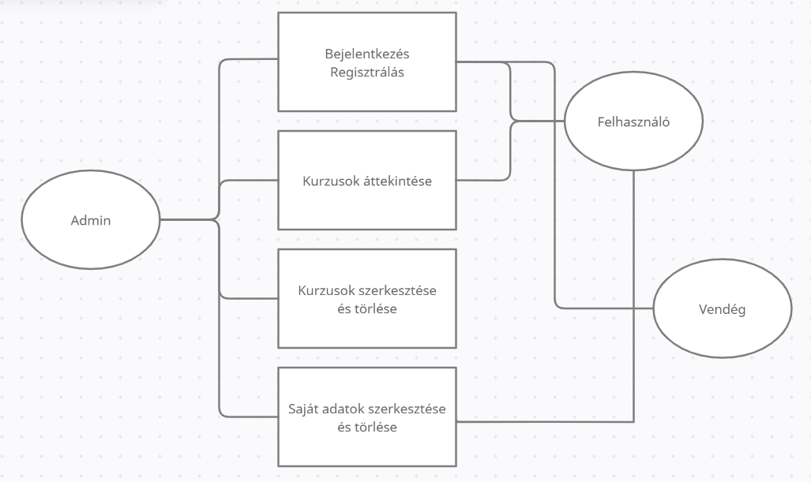

<ol>

## <li> Rendszer célja </li>

A projekt célja, hogy egy olyan online E-learning felületet valósítsunk meg, ami egyszerűen kezelhető a felhasználok számára, illetve áttekinthető online felülettel találkozzon minden látogató. 

Az E-learning felületen elérhető legyen minél több funkció, regisztráció, bejelentkezés, sötét/világos kinézet, kurzusok választása, áttekintése, tesztek választása és kitöltése is.   

A fő cél, hogy egyszerre több kurzus is élérhető legyen, bármely regisztrált felhasználó számára. 

## <li> Projekt terv</li>
<ul>

## <li>Projekttszerepkörök:</li>
<ul>
<li>Gyártmány tulajdonos: NO PHP csapat</li>
</ul>

## <li>Projektdolgozok és felelősségük:</li>
<ul>
<li>Backend fejlesztések: Csapat tagjai</li>
<li>Frontend fejlesztések: Csapat tagjai</li>
</ul>

## <li>Feladatuk:</li>
<ul>
<li>Adatbázis létrehozása</li>
<li>Funkciók elkészítése az oldal normal működéséhez</li>
<li>Felhasználó barát kezelés alkalmazása.</li>
<li>Felület kialakítása</li>
</ul>

## <li>Ütemterv:</li>
<ul>
<li>03.20 Követelmény specifikáció</li>
<li>03.28 Funkcionális specifikáció</li>
<li>04.01 Rendszerterv</li>
<li>04.12 Adatbázis kialakítása</li>
<li>04.20 Felhasználókezelés megvalósítása</li>
<li>04.25 Backend funkciók elkészítése</li>
<li>04.29 Frontend design letrehozása</li>
<li>05.02 Felhasználói felület megvalósítása</li>
</ul>
</ul>

## <li> Jelenlegi üzleti folyamatok modellje</li>
  
  

## <li> Követelmények</li>
<ul>

### <li>Funkcionális követelmény</li>
<ul>
<li>Felhasználok által megadott adatok tárolása</li>
<li>Felhasználok által megadott adatok modosítása</li>
<li>Felhasználok számára készített tesztek kitőltése</li>
<li>Felhasználok által kitöltött tesztek ellenőrzése</li>
<li>Admin által létrehozott tesztek és kurzusok</li>
<li>Admin által létrehozott tesztek és kurzusok szerkesztése</li>
</ul>

### <li>Egyéb követelmény</li>
<ul>
<li>Admin minden felülethez hozzá férhet</li>
<li>A felhasználó nem fér hozzá az admin felülethez</li>
</ul>

</ul>

## <li> Funkcionális terv </li>
<ul>

### <li>Rendszer szerepkörök</li>
<ul>
<li>Felhasznló</li>
<li>Vendég</li>
<li>Admin</li>
</ul>

### <li>Felhasznló</li>
<ul>
<li>Csatlakozhat kurzusokhoz</li>
<li>Kitőltheti a teszteket</li>
<li>Dokumentumokat tölthet fel</li>
<li>Szerkesztheti a saját adatait</li>
<li>Ellenőrizheti a tesztek megoldását</li>
</ul>

### <li>Vendég</li>
<ul>
<li>Megtekintheti az oldalt</li>
<li>Regisztrálhat az oldalra</li>
<li>Általános információkat megtekinthet</li>
</ul>

### <li>Admin</li>
<ul>
<li>Létrehozhat teszteket</li>
<li>Szerkesztheti illetve törölheti a teszteket, kurzusokat</li>
<li>Törölheti a felhasználokat</li>
<li>Minden regisztrált felhasználót lát</li>
<li>Teljes hatásköre van a felülethez</li>
</ul>

### <li>Felület felépítése</li>
<ul>
<li>Regisztráció</li>
<li>Főoldal</li>
<li>Bejelentkezés</li>
<ul>
<ul>
<li>Kurzusok megtekintése</li>
<li>Tesztek kitőltése, ellenőrzése</li>
<li>Profil megtekintése</li>
<li>Kijelentkezés</li>
</ul>
</ul>
</ul>
</ul>

## <li> Architekturális terv </li>

A felület megfelelő működéséhez szükség van egy adatbázis szerverre, jelen helyzetben MondoDB-t használunk. A bootstrap mint CSS keretrendszer felel a webdesign-ért. A backendet Next.js alapú keretrendszer segítségével valósítjuk meg.

## <li> Fizikai környezet </li>
<ul> 
<li>
Az alkalmazás web platformra készül, ExprexJS szerveren, MongoDB adatbázissal lesz futtatva.
</li>
<ul>
<li>Fejlesztő eszközök:</li>
<ul>
<li>NextJS</li>
<li>ExpresJS</li>
<li>Docker</li>
<li>MongoDB</li>
<li>Bootstrap</li>
</ul>

</ul>
</ul>

## <li> Adatbázis terv </li>
<ul>

### <li>Táblak</li>
<ul>
<li><strong>roles:</strong> A felhasználó adott szakahoz tartozó neve</li>
<li><strong>email:</strong> A felhasználó e-mail címe amit regisztrácókor meg kell adnia, nem lehet üres</li>
<li><strong>userName:</strong> A felhasználó neve amit regisztrácókor meg kell adnia, nem lehet üres</li>
<li><strong>userPassword:</strong> A felhasználó jelszava amit regisztrácókor meg kell adnia, nem lehet üres</li>
<li><strong>pictureId:</strong> Azonosító szám, mely a felhasználó profilképehez tartozik.</li>
<li><strong>profilePictureUrl:</strong> A felhasználóról itt tároljuk az urlt</li>
</ul>
</ul>

## <li>Implementációs terv</li>

A webes felület HTML, CSS  nyelven fog elkészülni. A technológiákat amennyire csak lehet, részekre bontva készítjük el. Az adatokat egy MondoDB adatbázis segítségével fogjuk tárolni. A weboldalt úgy készítjük el, hogy egyszerüen kezelhető és könnyen szerkeszthető legyen.

## <li>Tesztterv</li>
## <li>Telepítési terv</li>

A felület használatához egy egyszerű böngészőre van szükség. Amint telepítve van a böngésző már is lehet futattni a weboldalt. Ennek eléréséhez csak az URL linkre van szükség illetve a böngésző címsorában is rá lehet keresni.

## <li>Karbantartási terv</li>

A látogatok bejelentés formájában tudják jelenteni a felmerűlő hibákat az adminok felé, amit a fejlesztői csapat fog kijavítani. A beérkezett hibákat az adminok üzenet formájában fogják látni, amit majd továbbítanak a fejlesztőknek. Hiba javítási ideje alatt ha a szerver nem futna a felhasználók értesülést kapnak róla, hogy bizonyos időre xy funkció, oldal nem fog működni.

</ol>

